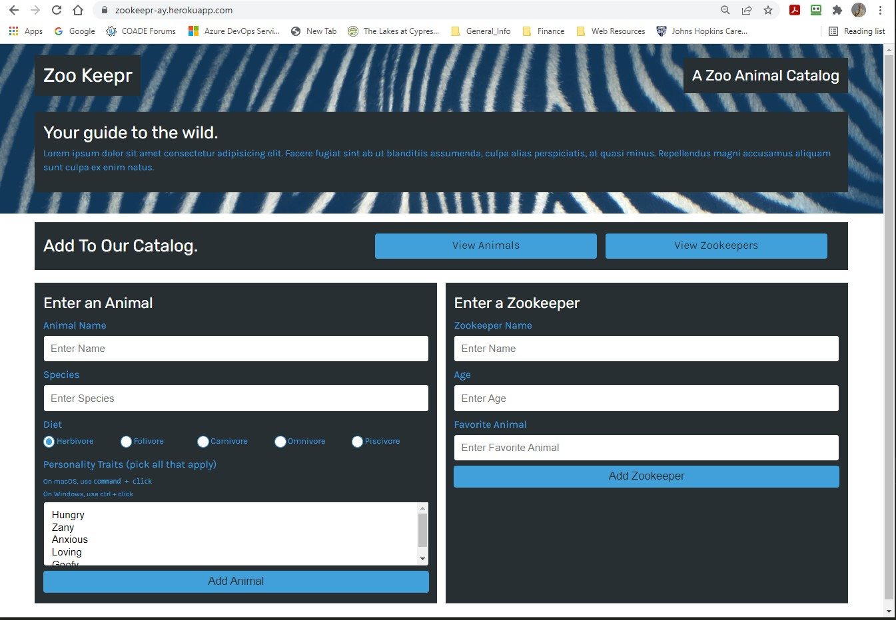

# Zoo-Keepr
# Jest Another RPG (Role Player Game)
Richard Ay (October 2020, *updated February 2022*)

## Table of Contents
* [Installation Instructions](#installation-instructions)
* [Usage Instructions](#usage-instructions)
* [Application Walk Through](#application-walk-through)
* [Technologies Used](#technologies-used)
* [Deployment Link](#deployment-link)
* [Application Screen Shots](#application-screen-shots)

    
## Installation Instructions
This application is deployed on Heroku, therefore it is NOT installed on the local machine.

## Usage Instructions
    
    From the browsers address line, issue the command: https:zookeepr-ay.herokuapp.com 

## Application Walk Through

## Technologies Used

* Node.js
* Express
* Heroku

## Deployment Link
The application is deployed on Heroku, see above usage instructions.

## Application Screen Shots

 Image of the application during use. 
